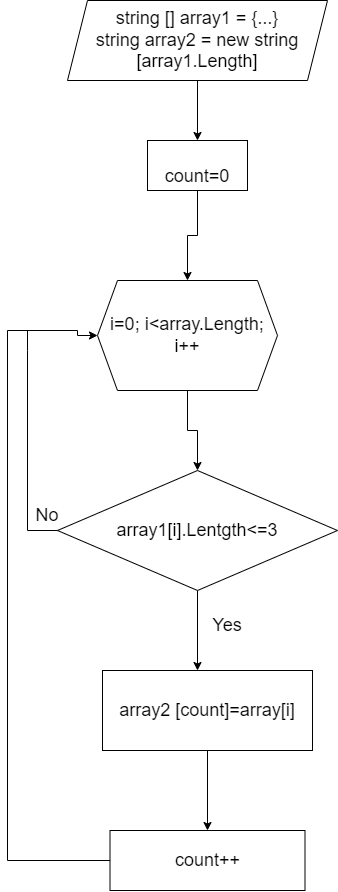

# Условие зачадчи
*Напиcать программу, которая из имеющегося массива строк формирует новый массив из строк, длина которых меньше, либо равна 3 символам. Первоначальный массив можно ввести с клавиатуры, либо задать на старте выполнения алгоритма. При решении не рекомендуется пользоваться коллекциями, лучше обойтись исключительно массивами.*

**Примеры**

***[“Hello”, “2”, “world”, “:-)”] → [“2”, “:-)”]***

***[“1234”, “1567”, “-2”, “computer science”] → [“-2”]***

***[“Russia”, “Denmark”, “Kazan”] → []***

# Решение

* Объявляем два массива - первый (массив который задаем) и второй( имеющий длину как у первого, который сформируем исходя из условий задачи).

* Создаем метод в котором создаем переменную count = 0.

* Объявляем цикл в котором выполняется проверка условия (<= 3).

* Если условия из пункта выше выполняется, то элемент первого * массива заносится в count и становится элементом второго массива.

* После присвоения переменная count увеличивается на 1 и так до конца цикла.

* Создается второй метод, позвляющий вывести новый получившийся массив.

# Блок-схема

